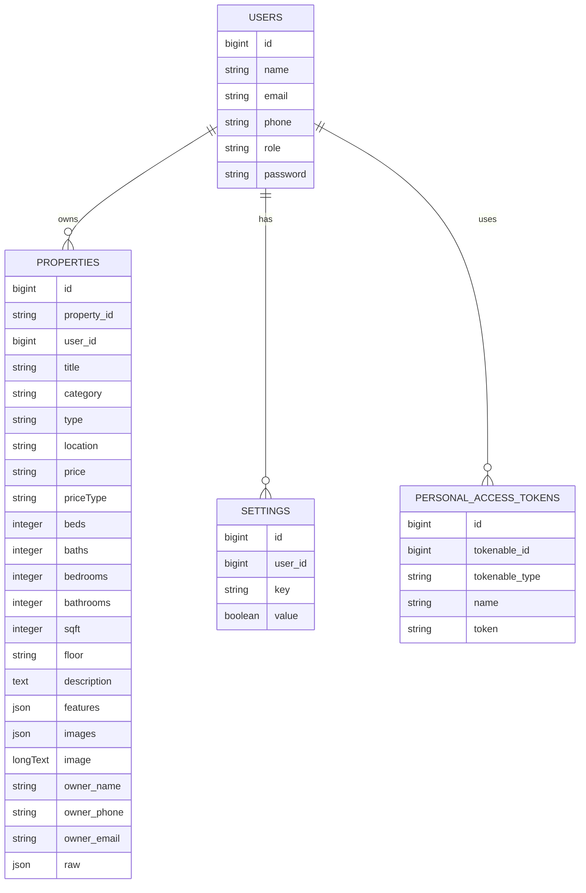
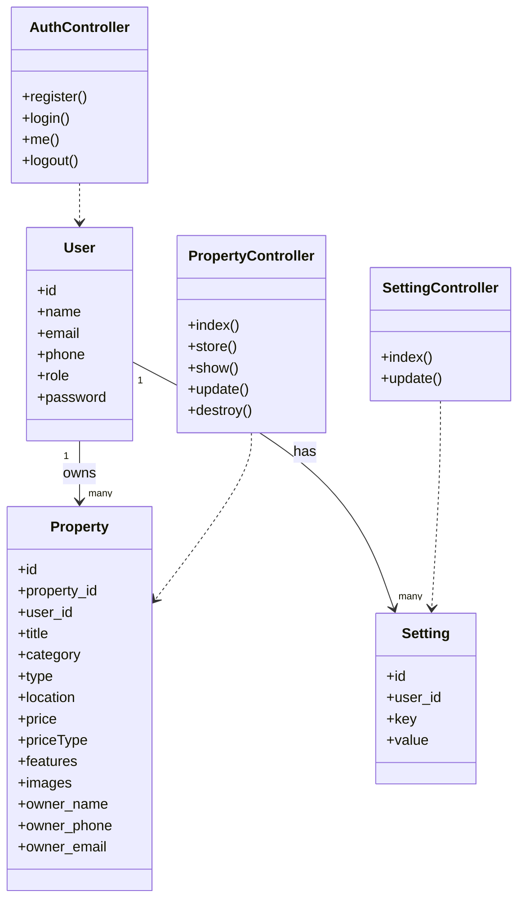
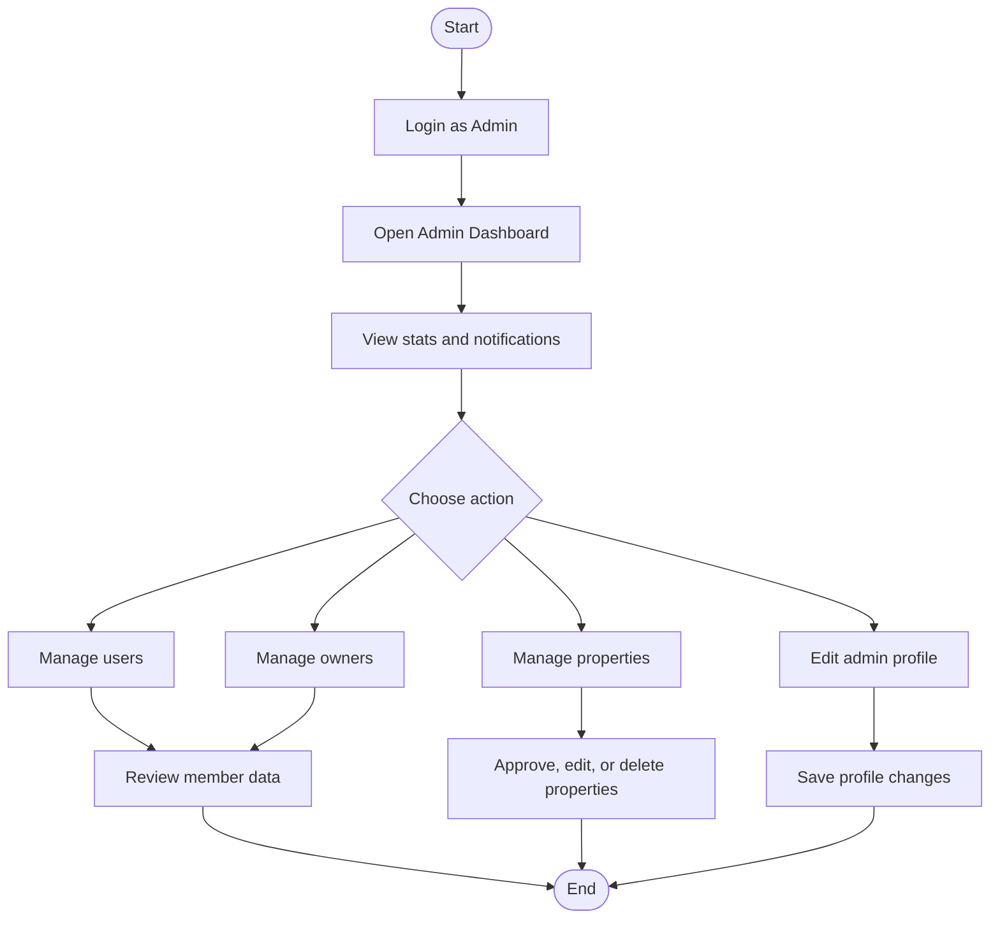
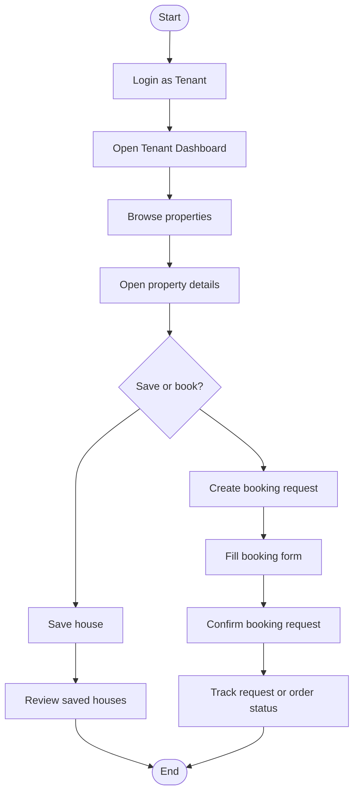
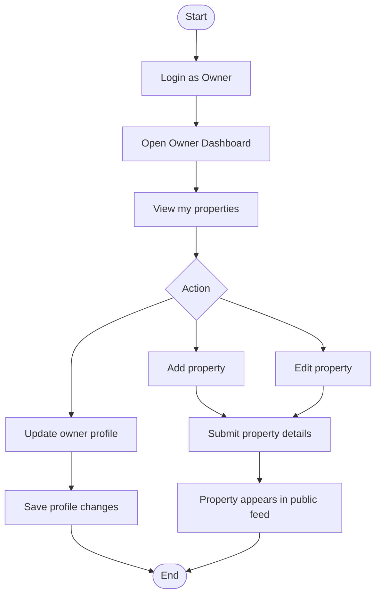
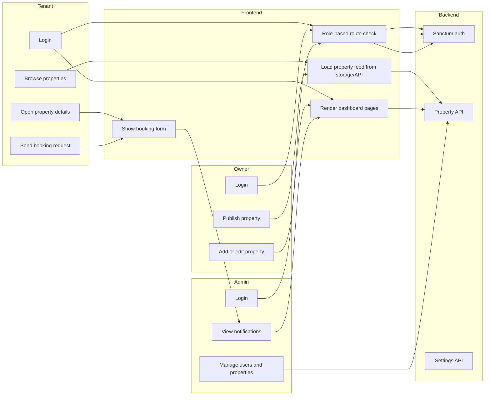

# BashaLagbe Diagrams

These diagrams are written to match the current project structure of BashaLagbe - Online House Rent Management System.

## ERD

## UML Class Diagram

## Admin Activity Diagram

## Tenant Activity Diagram

## Owner Activity Diagram

## Swimlane Diagram

## Notes
- The ERD reflects the current Laravel database tables.
- Booking and payment are shown as a current workflow, because the codebase does not yet have dedicated booking/payment tables.
- The swimlane diagram is a conceptual view of how tenant, owner, admin, frontend, and backend work together.